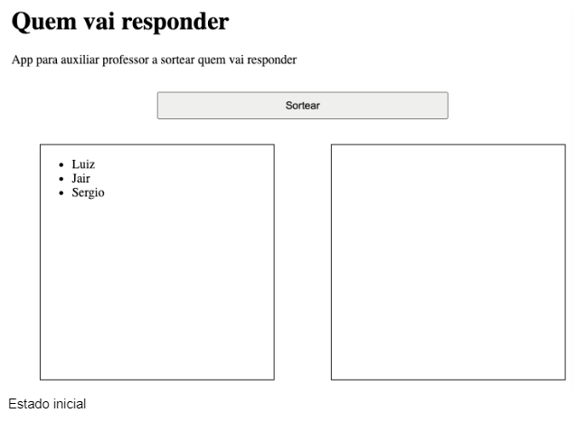
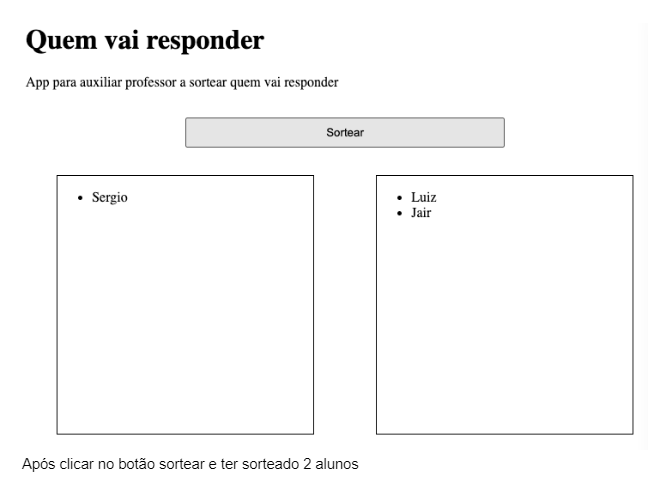
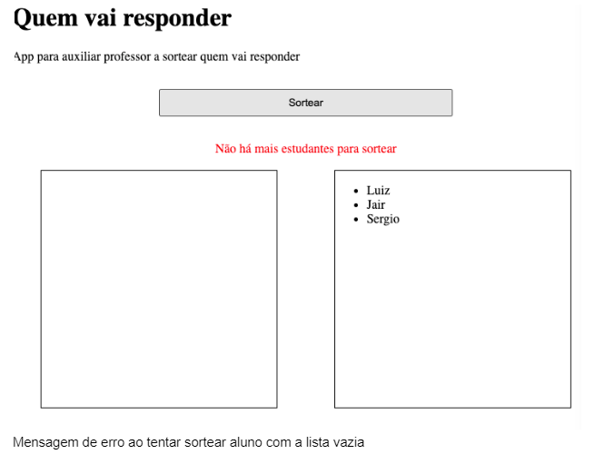

# Exercício-I

Criar interface para auxiliar professor a sortear quem vai responder na sala de aula. App tem que mostrar uma lista de alunos que ainda não respondeu, lista dos que já responderam, e botão que sorteie e remova aluno da primeira lista e adicione na segunda. Caso já tenha sorteado todos alunos, mostrar mensagem abaixo do botão avisando que não há mais alunos para sortear.
Extra: esconder mensagem de erro após 2 segundos.
Dica: use filter para remover.

Função que gera número aleatório:
```javascript
function randomIntFromInterval(min, max) { // max ta incluido
    return Math.floor(Math.random() * (max - min + 1) + min);
}
```





### How to run

```
npm i
npm start
```