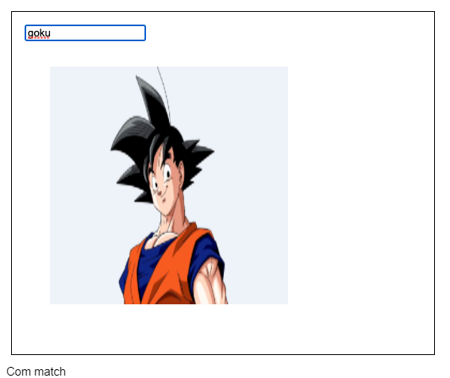

# Exercício-II

Criar interface com um input para usuário digitar nome do personagem e, caso tenha um match, mostrar a imagem dele. Enquanto não encontrar nenhum personagem com o nome digitado, mostrar texto dizendo que a imagem do personagem vai ali.




### How to run

```
npm i
npm start
```