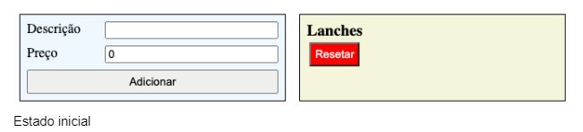
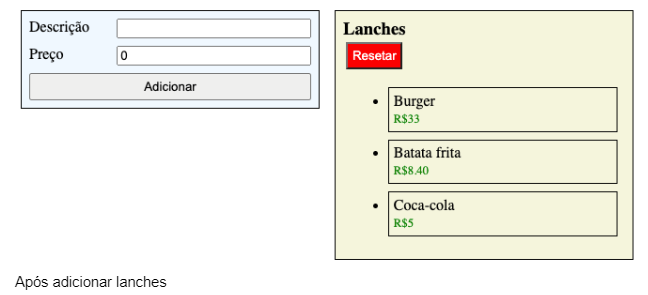
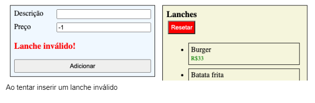
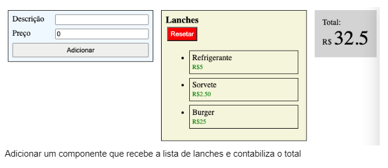

# Exercício-IV

Criar interface para criar e adicionar lanches em uma lista.
Necessário ter, pelo menos, 2 inputs para receber descrição e preço, e um botão para adicionar na lista de lanches.
Ao lado, tem que ser possível visualizar a lista de lanches adicionados com as suas informações.
Botão de resetar vai limpar a lista, retornando ao valor inicial.
Caso a descrição for vazia ou o preço for menor ou igual a zero quando tentar adicionar o lanche mostrar uma mensagem de erro. Assim que a pessoa entrar com algum dado novo, esconder a mensagem novamente.
Mostrar o valor total dos lanches adicionados na lista.






### How to run

```
npm i
npm start
```